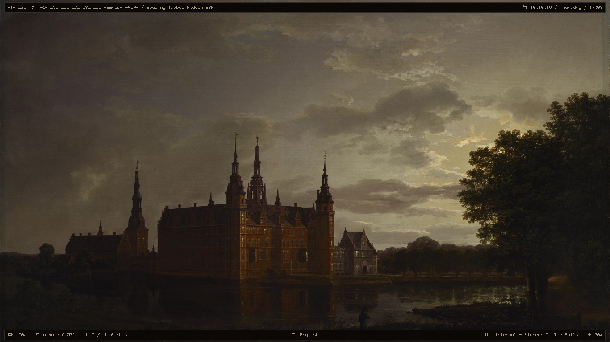

# Dotfiles

---

Different dotfiles which i use every day

- wm: xmonad **/** bspwm **(Xmonad config is mainly stolen from [here](https://git.systemd.club/xmonad-config/))**
- sh: zsh
- font: Iosevka **/** tewi
- bar: xmobar **/** polybar
- browser: qutebrowser **/** chrome
- editor: emacs **/** nvim
- term : st
